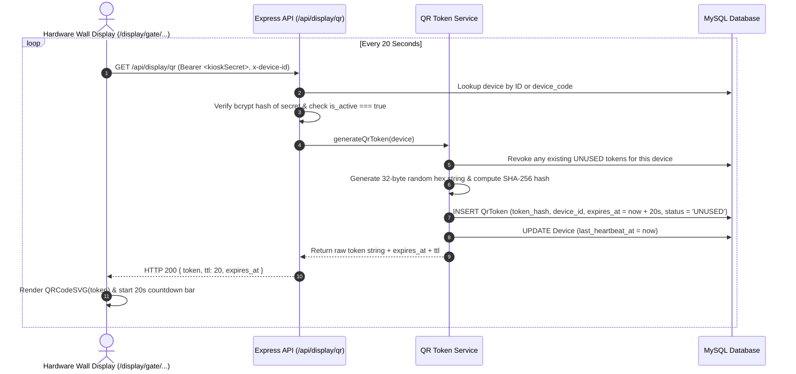
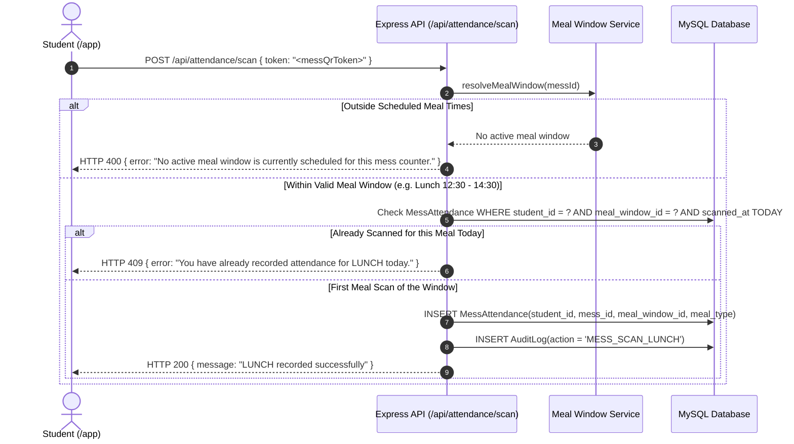
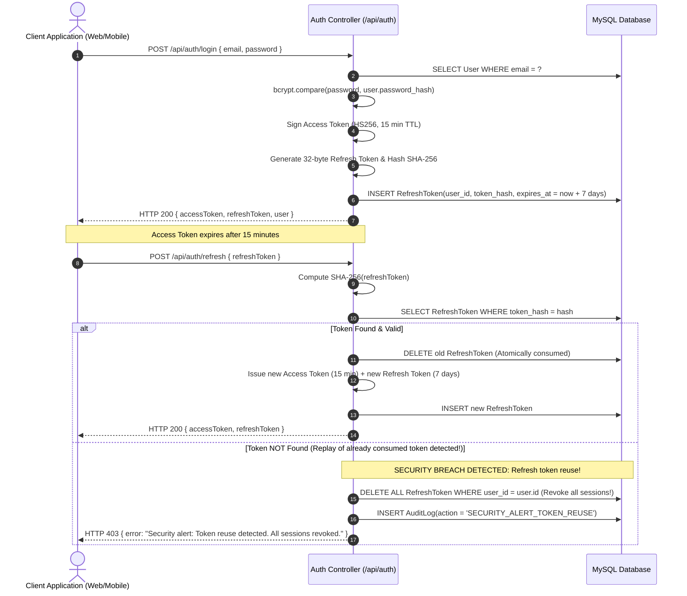
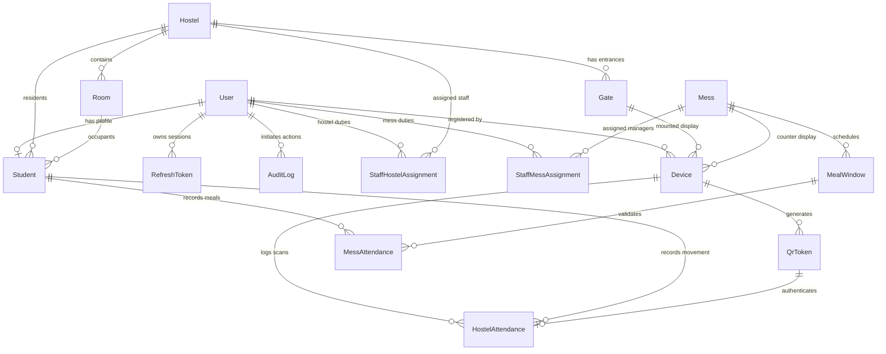

# HOSTEL360 — Complete System Architecture & Operational Guide

> **Single Source of Truth for System Architecture, Workflows, Role-Based Access Control, and Technical Implementation.**  
> Context: **Maulana Azad National Institute of Technology (MANIT), Bhopal**

---

## Table of Contents
1. [Executive Overview](#1-executive-overview)
2. [High-Level System Architecture](#2-high-level-system-architecture)
3. [Technology Stack](#3-technology-stack)
4. [User Personas & Role Matrix](#4-user-personas--role-matrix)
5. [Frontend Client Interfaces](#5-frontend-client-interfaces)
   - [5.1 Public & Unauthenticated Landing](#51-public--unauthenticated-landing)
   - [5.2 Student Portal (`/app`)](#52-student-portal-app)
   - [5.3 Hardware Wall Displays (`/display/*`)](#53-hardware-wall-displays-display)
   - [5.4 Operations Control Center (`/dashboard/*`)](#54-operations-control-center-dashboard)
6. [Core Workflows & Sequence Diagrams](#6-core-workflows--sequence-diagrams)
   - [6.1 Dynamic 20s QR Code Rotation & Lifecycle](#61-dynamic-20s-qr-code-rotation--lifecycle)
   - [6.2 Student Camera Scan & Directional State Flip](#62-student-camera-scan--directional-state-flip)
   - [6.3 Anti-Proxy Kiosk Photo Confirmation Flash](#63-anti-proxy-kiosk-photo-confirmation-flash)
   - [6.4 Mess Meal Window & Anti-Double-Dipping Engine](#64-mess-meal-window--anti-double-dipping-engine)
   - [6.5 Dual-Token JWT Authentication & Breach Detection](#65-dual-token-jwt-authentication--breach-detection)
7. [MANIT Campus Rules & Domain Logic](#7-manit-campus-rules--domain-logic)
8. [Database Schema & Data Models](#8-database-schema--data-models)
9. [Security Architecture & Anti-Abuse Controls](#9-security-architecture--anti-abuse-controls)
10. [Test Suite, Deployment & Quick Start](#10-test-suite-deployment--quick-start)

---

## 1. Executive Overview

**HOSTEL360** is a full-stack, enterprise-grade, real-time hostel and mess management system designed specifically for collegiate campus environments (modeled on **MANIT Bhopal**).

Traditional hostel attendance systems suffer from proxy attendance, stolen identity cards, manual register bottlenecks, and outdated paper mess coupons. HOSTEL360 eliminates these vulnerabilities through a **reverse QR scanning model**:

```
[ Traditional Flawed Model ]
Student Phone shows static QR  ──>  Guard scans  ──>  Prone to forwarding QR screenshots / proxies

[ HOSTEL360 Reverse Security Model ]
Fixed Gate Wall Display shows 20s dynamic QR  ──>  Student Phone Camera Scans  ──>  5s Photo Flashes on Gate Wall
```

### Core Value Pillars
1. **Dynamic Short-Lived QR Tokens**: Gate and mess displays continuously rotate opaque 32-byte cryptographic tokens with a 20-second Time-To-Live (TTL). Tokens can only be consumed once.
2. **Instant Anti-Proxy Confirmation Flash**: Within milliseconds of a student scan, the gate kiosk flashes a full-screen confirmation modal with the student's verified name, photo, and direction for 5 seconds to on-site security guards.
3. **Atomic Directional State Management**: The backend infers movement (`INSIDE` $\rightarrow$ `EXIT` $\rightarrow$ `OUTSIDE` and `OUTSIDE` $\rightarrow$ `ENTRY` $\rightarrow$ `INSIDE`) in an atomic database transaction.
4. **Hostel Scope Isolation**: Students assigned to Hostel H1 cannot scan into Hostel H8 gates; the gate controller verifies student-hostel binding in real-time.
5. **Real-Time Operational Monitoring**: Wardens, Mess Admins, and Super Admins receive real-time Socket.IO broadcasts of every gate movement and meal served without needing to refresh pages.

---

## 2. High-Level System Architecture

The application is architected as a modern, decoupled client-server platform with real-time bidirectional WebSocket synchronization:

```mermaid
graph TB
    subgraph Client Layer
        SPA["Single Page App (React 19 + TypeScript + Vite)"]
        KioskBrowser["Hardware Gate & Mess Displays (Chromium Kiosk Mode)"]
        StudentMobile["Student Mobile Camera Viewfinder (jsQR)"]
        AdminBrowser["Staff Operations Control Center (Tailwind CSS)"]
    end

    subgraph Ingress & Security
        Nginx["Nginx Reverse Proxy / Load Balancer (Port 80/443)"]
        RateLimiter["Rate Limiting & Helmet Guard (5 req/min per student)"]
    end

    subgraph Application Layer (Node.js & Express)
        AuthService["Auth & Session Service (JWT + Refresh Tokens)"]
        QRService["QR Token Service (Crypto 32-byte Opaque + SHA-256)"]
        AttendanceController["Attendance Engine (Atomic Prisma Transactions)"]
        MealWindowService["Mess Schedule Engine (Time-Bounded Windows)"]
        AnalyticsService["Streaming CSV & SVG Analytics Engine"]
        SocketServer["Socket.IO Broadcast Server (Rooms & Namespaces)"]
    end

    subgraph Data Persistence Layer
        PrismaORM["Prisma ORM Client"]
        MySQL[("MySQL 8.0+ Relational Database")]
    end

    KioskBrowser -->|HTTP / Socket.IO| Nginx
    StudentMobile -->|HTTP REST| Nginx
    AdminBrowser -->|HTTP / Socket.IO| Nginx
    SPA --> KioskBrowser
    SPA --> StudentMobile
    SPA --> AdminBrowser

    Nginx --> RateLimiter
    RateLimiter --> AuthService
    RateLimiter --> QRService
    RateLimiter --> AttendanceController
    RateLimiter --> MealWindowService
    RateLimiter --> AnalyticsService

    AttendanceController --> SocketServer
    SocketServer -.->|display:confirm| KioskBrowser
    SocketServer -.->|attendance:new| AdminBrowser

    AuthService --> PrismaORM
    QRService --> PrismaORM
    AttendanceController --> PrismaORM
    MealWindowService --> PrismaORM
    AnalyticsService --> PrismaORM
    PrismaORM --> MySQL
```

---

## 3. Technology Stack

| Layer | Technology | Key Libraries & Specifications |
| :--- | :--- | :--- |
| **Frontend Framework** | React 19 + TypeScript | Strict typing, Hooks (`useState`, `useEffect`, `useCallback`, `useRef`) |
| **Build & Tooling** | Vite 8.3 | Rolldown engine, ES modules, lightning HMR |
| **Styling & UI** | Tailwind CSS v3 | Curated dark-mode theme (`slate-950` palette), custom animations, glassmorphism |
| **Icons & Visuals** | Lucide React | Modern vector icon set |
| **QR Engine (Frontend)** | `qrcode.react` (SVG) + `jsQR` | High-precision vector SVG rendering & raw camera canvas pixel scanner |
| **Real-Time Client** | Socket.IO Client | Auto-reconnection, room-scoped event listeners |
| **Backend Runtime** | Node.js (v22+) + Express | RESTful architecture, middleware pipelines |
| **Database & ORM** | MySQL 8.0+ & Prisma ORM 5.x | Declarative schema, relational migrations, connection pooling, ACID transactions |
| **Security & Cryptography** | `crypto` + `bcrypt` + `jsonwebtoken` | 32-byte opaque crypto tokens, 10-round bcrypt salt, dual JWT tokens (HS256) |
| **Data Validation** | Zod 3.x | Strict schema validation for registration, devices, and logins |
| **Containerization** | Docker & Docker Compose | Multi-stage production Dockerfiles, Alpine Linux, Nginx reverse proxy |

---

## 4. User Personas & Role Matrix

HOSTEL360 implements strict **Role-Based Access Control (RBAC)** across real-world collegiate roles reflecting MANIT's organizational hierarchy:

| Role | Target Persona | Primary Auth Mechanism | Accessible Routes | Permitted Operations |
| :--- | :--- | :--- | :--- | :--- |
| **`SUPER_ADMIN`** | Chairman of the Council of Wardens (COW) office & Dean of Student Welfare (DSW) | JWT Bearer Access Token (15 min) | `/dashboard/*` (Campus-wide) | • Campus-wide oversight of all 12 hostels<br>• Register hardware kiosk devices & issue secrets<br>• Create & delete hostels, rooms, and students<br>• Manage staff assignments (Wardens, Vice Wardens, Caretakers)<br>• Deactivate compromised devices instantly<br>• View campus-wide audit logs & analytics |
| **`WARDEN`** | Faculty member in charge of a specific hostel (e.g. H5 Warden) | JWT Bearer Access Token (15 min) | `/dashboard`, `/dashboard/hostels`, `/dashboard/students`, `/dashboard/history`, `/dashboard/analytics` | • Hostel-scoped live occupancy & gate feeds<br>• View student room allocations in assigned hostel<br>• Update student room assignments<br>• View historical gate traffic for assigned hostel<br>• Export hostel attendance CSV reports |
| **`VICE_WARDEN`** | Assistant faculty supporting the Warden with delegated authority | JWT Bearer Access Token (15 min) | `/dashboard`, `/dashboard/hostels`, `/dashboard/students`, `/dashboard/history`, `/dashboard/analytics` | • Hostel-scoped live occupancy monitoring<br>• View student directory & room allocations<br>• View attendance logs & export analytics for assigned hostel |
| **`CARETAKER`** | Non-faculty operational staff on duty at each hostel | JWT Bearer Access Token (15 min) | `/dashboard`, `/dashboard/hostels`, `/dashboard/students`, `/dashboard/history`, `/dashboard/analytics` | • Operational student state corrections (`INSIDE` $\leftrightarrow$ `OUTSIDE`) with mandatory audit reason<br>• Room occupancy checks & room reallocations<br>• Live gate attendance feed monitoring<br>• Search student directory |
| **`MESS_ADMIN`** | Campus mess contractor or dining hall supervisor | JWT Bearer Access Token (15 min) | `/dashboard`, `/dashboard/messes`, `/dashboard/history`, `/dashboard/analytics` | • Configure meal windows (Breakfast, Lunch, Snacks, Dinner)<br>• View live meal serving counts<br>• Monitor meal window compliance & anti-double-dipping<br>• Export mess consumption reports |
| **`STUDENT`** | Enrolled undergraduate/postgraduate student residing in a campus hostel | JWT Bearer Access Token (15 min) | `/app`, `/app/history`, `/app/mess` | • Camera QR scanning at gate and mess kiosks<br>• View own INSIDE/OUTSIDE status<br>• View personal hostel entry/exit log<br>• View personal mess attendance history |
| **`DEVICE`** | Fixed wall-mounted tablet or Raspberry Pi at hostel gate or mess counter | Device Secret (`kiosk123`) passed in `Authorization: Bearer` and `x-device-id` header | `/display/gate/:deviceId`, `/display/mess/:deviceId` | • Fetch 20s dynamic QR code<br>• Join device-scoped Socket.IO room<br>• Receive 5s photo confirmation flash<br>• Report device heartbeat |

---

## 5. Frontend Client Interfaces

The entire platform is delivered through a single responsive React Single Page Application (SPA), dynamically tailored to the authenticated user's permissions.

```
Frontend Navigation Routing Logic
├── Not Authenticated:
│   ├── / -> Home Landing (Overview & Portals)
│   ├── /login -> Authentication Screen (Presets available)
│   └── /display/* -> Hardware Wall Displays (Device secret protected)
├── Authenticated as STUDENT:
│   ├── /app -> Student Scanner & Profile View
│   └── Navbar shows ONLY "Student Scanner" and Sign Out
└── Authenticated as STAFF / ADMIN (WARDEN, MESS_ADMIN, SUPER_ADMIN):
    ├── /dashboard -> Operations Hub
    ├── /dashboard/devices -> Kiosk Registration & Secrets (Super Admin)
    ├── /dashboard/hostels -> 12 Hostels Directory & Room Grid
    ├── /dashboard/students -> Student Directory & Room Allocation
    ├── /dashboard/messes -> Mess Window Schedule & Active Services
    ├── /dashboard/history -> Live & Historical Filterable Log
    ├── /dashboard/analytics -> Interactive SVG Trends & CSV Export
    └── Navbar shows ONLY "Control Center" and Sign Out
```

### 5.1 Public & Unauthenticated Landing (`/`)
- **Header**: Branding with MANIT Bhopal badge, role-sensitive navigation links, and Sign In action.
- **Hero**: Clean explanation of the reverse dynamic QR scanning model.
- **Three Architecture Portals**:
  1. **Student Portal Card**: Links to `/app`, explaining camera scanning.
  2. **Staff & Admin Card**: Links to `/dashboard`, detailing warden and mess controls.
  3. **Hardware Wall Terminals Card**: Provides direct launch links to active campus kiosks:
     - `H1 Gate Display (H1_GATE_TEST_7214)`
     - `Central Mess Display (MESS_DEV_8859)`
     - `H8 Gate Display (H8_GATE_1)`
- **Sign In Page (`/login`)**:
  - Secure email and password fields.
  - Quick-login demo preset buttons with one-click credential prefill:
    - Super Admin: `admin@hostel360.com` / `password123`
    - Warden: `warden.h5@hostel360.com` / `password123`
    - Mess Admin: `messadmin@hostel360.com` / `password123`
    - Student: `aarav.sharma@student.hostel360.com` / `password123`

---

### 5.2 Student Portal (`/app`)
*Mobile-first interface exclusively accessible to students.*

1. **Student Identity & Status Card**:
   - **Student Photo & Live Indicator**: Avatar with green (`INSIDE HOSTEL`) or amber (`OUTSIDE HOSTEL`) pulsing indicator ring.
   - **Student Identity**: Full Name, Department, Year, and Roll Number.
   - **Hostel & Room Assignment**: Displays assigned hostel (e.g., `Homi Jehangir Bhabha Bhawan - H1`) and room number (e.g., `01001`).
   - **Current State Badge**: High-contrast indicator showing whether the student is currently marked inside or outside, plus next movement forecast (*"Next gate scan will trigger: EXIT"*).

2. **Scanner Tab (`activeTab === 'scan'`)**:
   - **"Launch Camera Scanner" Button**: Requests camera permissions and opens the live camera viewfinder.
   - **Camera Viewfinder**:
     - Uses `facingMode: 'environment'` (rear phone camera preferred).
     - Renders a futuristic scanning laser line with corner reticle brackets.
     - Continuously processes frames using `jsQR`.
     - Automatically stops camera upon successful scan or cancellation.
   - **Result Notification Banner**:
     - Flashes green for success (`ENTRY CONFIRMED` or `EXIT CONFIRMED`) or red for errors.
     - Displays timestamp and updated current state.
   - **Manual Token Fallback ("Paste & Scan")**:
     - Form to paste 64-character token strings for testing on laptops/desktops without a rear camera.
     - Includes a one-click **"Paste & Scan"** clipboard button.

3. **Entry/Exit History Tab (`activeTab === 'history'`)**:
   - Reverse chronological timeline of the student's personal gate movements.
   - Badges showing `ENTRY` (green) or `EXIT` (amber), gate name, hostel code, and formatted Indian Standard Time (IST).

4. **Mess Attendance Tab (`activeTab === 'mess'`)**:
   - Historical log of meals consumed by the student (Breakfast, Lunch, Snacks, Dinner) with date and timestamp.

---

### 5.3 Hardware Wall Displays (`/display/gate/:deviceId` and `/display/mess/:deviceId`)
*Borderless, high-contrast, wall-mounted display mode designed for 24/7 fixed kiosk screens.*

1. **Device Authentication Modal**:
   - Appears if the screen has not yet stored its secret.
   - Requests the device secret (default: `kiosk123`).
   - Automatically stores the secret in `localStorage` under `hostel360_device_secret_<deviceId>` for persistent auto-login upon kiosk reboot.

2. **Kiosk Header Bar**:
   - Left: HOSTEL360 Kiosk Terminal badge.
   - Center: Hostel Name and Gate Name (e.g., `Homi Jehangir Bhabha Bhawan — Main Gate`).
   - Right: Real-time digital clock (12-hour format with seconds), current date, live `ONLINE` connection badge, and Fullscreen toggle button.

3. **Rotating Dynamic QR Card**:
   - **High-Contrast 280px QR Code**: Generated dynamically via `QRCodeSVG` using the 32-byte opaque cryptographic token.
   - **Countdown Timer & Progress Bar**:
     - Visual countdown pill: *"Rotates in 20s"*.
     - Smooth progress bar that shifts colors (green $\rightarrow$ amber $\rightarrow$ red) as expiration approaches.
     - Automated fetch when counter reaches zero.
   - **Developer / Testing Action**: Includes a **"Copy Token (Test on Student App)"** button to test the scanning flow on a single screen without a physical camera.

4. **Mess Kiosk Standby Mode**:
   - If a mess kiosk is accessed outside scheduled meal windows, the QR code automatically enters standby mode, displaying the countdown to the next scheduled service (e.g., *"Next Service: Dinner (20:00 - 22:00)"*).

5. **5-Second Anti-Proxy Confirmation Flash Overlay**:
   - Activated via real-time Socket.IO event `display:confirm`.
   - Full-screen high-contrast modal featuring:
     - Large animated checkmark badge.
     - Green movement badge: `ENTRY CONFIRMED` or `EXIT CONFIRMED`.
     - Student profile photo in large view.
     - Student Full Name, Roll Number, Assigned Room, and exact scan timestamp.
     - Automatically dismisses after 5 seconds to resume the rotating QR code.

---

### 5.4 Operations Control Center (`/dashboard/*`)
*Unified administrative portal accessible by Wardens, Mess Admins, and Super Admins.*

#### 1. Dashboard Hub (`/dashboard`)
- **Key Metrics Tiles**: Total Campus Occupancy, Inside Count, Outside Count, and Total Daily Scans.
- **Gender Occupancy Cards**: Breakdown of Boys Hostels vs Girls Hostels occupancy percentages.
- **Live Gate Activity Stream**: Real-time websocket-powered feed displaying student arrivals and departures across campus as they happen.
- **Hostel Occupancy Grid**: Capacity progress bars for all 12 MANIT hostels.

#### 2. Device Management (`/dashboard/devices`) *(Super Admin)*
- **Registered Kiosks Table**: Lists all active and inactive gate displays and mess counters.
- **Registration Modal**: Form to register new gate kiosks (bound to a specific hostel and gate) or mess kiosks (bound to a dining hall).
- **Secret Generator**: Generates secure 32-byte hexadecimal secrets displayed once to the administrator upon creation.
- **Instant Kill-Switch**: One-click activate/deactivate toggle to instantly revoke a compromised or decommissioned kiosk.
- **Heartbeat Monitor**: Shows last reported online heartbeat and IP timestamp.

#### 3. Hostels & Rooms Management (`/dashboard/hostels`) *(Super Admin, Warden)*
- **12 Hostels Directory**: Cards for H1 through H12 with warden assignments, capacities, and types (`BOYS` / `GIRLS`).
- **Floor-wise Room Inspector**: Interactive grid showing all rooms per floor.
- **5-Digit Room Badges**: Formatted according to MANIT campus convention `[HH][F][RR]`.
- **Room Status Indicators**: Visual badges indicating whether a room is Empty, Partially Occupied, or Full.

#### 4. Student Management (`/dashboard/students`) *(Super Admin, Warden)*
- **Student Directory Table**: Comprehensive roster of students with roll numbers, names, departments, years, and assigned rooms.
- **Search & Filter**: Real-time search by roll number, name, or filter by specific hostel.
- **Current State Badge**: Live indicator of whether the student is currently inside or outside.
- **Allocation Manager**: Form to assign or transfer students to rooms, strictly enforcing gender constraints.

#### 5. Mess & Meal Window Management (`/dashboard/messes`) *(Super Admin, Mess Admin)*
- **Active Dining Windows**: Real-time indicator showing which meal is currently live (Breakfast, Lunch, Snacks, Dinner).
- **Meal Schedule Table**: Start and end times for all four daily meals.
- **Window Editor**: Ability to adjust meal window timings to accommodate campus events or holidays.

#### 6. Unified Attendance History (`/dashboard/history`) *(Super Admin, Warden, Mess Admin)*
- **Filterable Tabular Log**: Full history of gate and mess scans.
- **Multi-Parameter Filtering**: Filter by date range, hostel, movement direction (`ENTRY` / `EXIT`), meal type, or student search.
- **Pagination**: High-performance paginated queries for large datasets.

#### 7. Analytics & Export Center (`/dashboard/analytics`) *(Super Admin, Warden, Mess Admin)*
- **7-Day Occupancy Trend Chart**: Interactive SVG line chart tracking peak campus occupancy over the preceding week.
- **Hourly Gate Traffic Histogram**: Bar chart identifying rush hours (e.g. 17:00–19:30).
- **Mess Meal Breakdown**: Donut / bar chart comparing uptake across Breakfast, Lunch, Snacks, and Dinner.
- **One-Click Streaming CSV Exports**:
  - Export Hostel Gate Attendance (`GET /api/analytics/export/hostel-attendance`).
  - Export Mess Meal Consumption (`GET /api/analytics/export/mess-attendance`).
  - Implements HTTP chunked streaming directly from MySQL to prevent server memory spikes.

---

## 6. Core Workflows & Sequence Diagrams

### 6.1 Dynamic 20s QR Code Rotation & Lifecycle



---

### 6.2 Student Camera Scan & Directional State Flip

```mermaid
sequenceDiagram
    autonumber
    actor Student as Student Smartphone (/app)
    actor Display as Kiosk Wall Monitor
    participant Backend as Express API (/api/attendance/scan)
    participant TokenService as QR Validation Service
    participant DB as MySQL Database
    participant Sockets as Socket.IO Hub

    Student->>Student: Points camera at Kiosk; jsQR reads 64-char token string
    Student->>Backend: POST /api/attendance/scan { token: "..." } (Bearer <studentJWT>)
    
    Backend->>Backend: Apply scanRateLimiter (Max 5 scans/minute per student)
    Backend->>DB: Fetch authenticated Student profile & hostel assignment
    Backend->>TokenService: validateAndConsume(token)
    
    TokenService->>TokenService: Compute SHA-256(token)
    TokenService->>DB: SELECT QrToken WHERE token_hash = hash
    TokenService->>TokenService: Verify status === 'UNUSED' & expires_at > NOW()
    TokenService->>DB: UPDATE QrToken SET status = 'USED' (Atomic transition)
    TokenService-->>Backend: Token Validated

    Backend->>Backend: Check Security Constraint: qrToken.gate.hostel_id === student.hostel_id
    Note over Backend: If student assigned to H1 tries scanning H8 gate -> Reject 403 HOSTEL_MISMATCH

    Backend->>Backend: Infer Direction:<br/>If student.current_state == 'INSIDE' -> Direction = 'EXIT', NextState = 'OUTSIDE'<br/>If student.current_state == 'OUTSIDE' -> Direction = 'ENTRY', NextState = 'INSIDE'

    Backend->>DB: prisma.$transaction()<br/>1. INSERT HostelAttendance(student_id, gate_id, direction)<br/>2. UPDATE Student SET current_state = NextState<br/>3. INSERT AuditLog(action = 'HOSTEL_SCAN_ENTRY/EXIT')

    Backend->>Sockets: io.to("device:<deviceId>").emit("display:confirm", { studentName, photoUrl, direction })
    Backend->>Sockets: io.to("hostel:<hostelId>").emit("attendance:new", { ...attendanceRecord })
    Backend->>Sockets: io.to("admin:feed").emit("attendance:new", { ...attendanceRecord })

    Sockets-->>Display: Trigger 5-Second Confirmation Flash
    Backend-->>Student: HTTP 200 { message: "ENTRY recorded successfully", student_state: NextState }
    Student->>Student: Update Profile Card to INSIDE/OUTSIDE & Refresh Logs
```

---

### 6.3 Anti-Proxy Kiosk Photo Confirmation Flash

```mermaid
sequenceDiagram
    autonumber
    participant Kiosk as Wall Display Tablet
    participant Socket as Socket.IO Client Engine
    participant Guard as On-Site Security Guard

    Socket->>Kiosk: Event 'display:confirm' { studentName, rollNumber, photoUrl, direction, timestamp }
    Kiosk->>Kiosk: Interrupt QR display; Mount full-screen flash modal
    Kiosk->>Guard: Displays large student photo, name, and roll number
    Guard->>Guard: Compares face on screen with physical person walking past gate
    Note over Kiosk: Guard catches proxy if another student scanned using forwarded screenshot
    Kiosk->>Kiosk: 5-Second Timer expires
    Kiosk->>Kiosk: Unmount modal; Resume rotating dynamic QR code
```

---

### 6.4 Mess Meal Window & Anti-Double-Dipping Engine



---

### 6.5 Dual-Token JWT Authentication & Breach Detection



---

## 7. MANIT Campus Rules & Domain Logic

The system strictly mirrors the physical layout and administrative conventions of **MANIT Bhopal**:

### 1. The 12 Hostels Master Directory
- **Boys Hostels (10 Hostels)**:
  - **H1**: *Homi Jehangir Bhabha Bhawan* (Capacity: 192)
  - **H2**: *Vikram Sarabhai Bhawan* (Capacity: 176)
  - **H3**: *Hostel No. 3* (Capacity: 120)
  - **H4**: *Hostel No. 4* (Capacity: 120)
  - **H5**: *Mokshagundam Visvesvarayya Bhawan* (Capacity: 80)
  - **H6**: *Jagadish Chandra Bose Bhawan* (Capacity: 80)
  - **H8**: *Ramanujan Bhawan* (Capacity: 260)
  - **H9**: *Raja Ramanna Bhawan* (Capacity: 176)
  - **H10**: *Dr. APJ Abdul Kalam Bhawan* (Capacity: 1024, Divided into 4 Blocks: A, B, C, D)
  - **H11**: *Appu Bhavan* (Capacity: 48, Scholars / PhD)
- **Girls Hostels (2 Hostels)**:
  - **H7**: *Kalpana Chawla Bhawan* (Capacity: 144)
  - **H12**: *Bhagini Nivedita Bhawan* (Capacity: 200)

### 2. Standard 5-Digit Room Numbering Scheme: `[HH][F][RR]`
Every room across the 12 hostels follows a standard 5-character string formula:
$$\text{Room Code} = \mathbf{HH} + \mathbf{F} + \mathbf{RR}$$
- $\mathbf{HH}$ = 2-Digit Hostel Number (`01` through `12`).
- $\mathbf{F}$ = 1-Digit Floor Number (`0` for Ground Floor, `1` for 1st Floor, `2` for 2nd Floor, etc.).
- $\mathbf{RR}$ = 2-Digit Room Number on that floor (`01` through `99`).
- *Examples*:
  - `01001` = Hostel 1 (Homi Bhabha), Ground Floor, Room 01.
  - `05112` = Hostel 5 (Visvesvarayya), 1st Floor, Room 12.
  - `10215` = Hostel 10 (Kalam Bhawan), 2nd Floor, Room 15.

### 3. Strict Gender Allocation Constraint
- Female students (`gender: 'FEMALE'`) can **only** be assigned to rooms in **H7** or **H12**.
- Male students (`gender: 'MALE'`) can **only** be assigned to rooms in **H1–H6, H8–H11**.
- Attempts to allocate a male student to H7/H12 or a female student to H1–H6/H8–H11 are rejected with HTTP 400 (`GENDER_RESTRICTION`).

### 4. Gate-to-Hostel Boundary Enforcement
- When a student scans a QR code at a gate, the system checks whether the gate's parent hostel matches the student's assigned hostel (`qrToken.gate.hostel_id === student.hostel_id`).
- If a student from H1 scans at the gate of H8, access is denied with HTTP 403 (`HOSTEL_MISMATCH`).

### 5. Scheduled Mess Meal Windows
Central Campus Mess serves four scheduled daily meal windows:
- **Breakfast**: 07:30 – 09:30
- **Lunch**: 12:30 – 14:30
- **Snacks**: 17:00 – 18:30
- **Dinner**: 20:00 – 22:00

---

## 8. Database Schema & Data Models

The relational schema is managed through Prisma ORM mapping to MySQL:



### Key Relational Entities

1. **`User`**: Base authentication table storing email, bcrypt password hash, role (`STUDENT`, `WARDEN`, `VICE_WARDEN`, `CARETAKER`, `MESS_ADMIN`, `SUPER_ADMIN`), and active status.
2. **`Student`**: Linked 1:1 to User; contains roll number, gender, department, year, photo URL, current location state (`INSIDE` / `OUTSIDE`), assigned hostel ID, and assigned room ID.
3. **`StaffHostelAssignment`**: Many-to-many junction mapping staff members (`WARDEN`, `VICE_WARDEN`, `CARETAKER`) to specific hostels with primary warden flags and assignment timestamps.
4. **`StaffMessAssignment`**: Junction linking mess contractors and dining supervisors (`MESS_ADMIN`) to specific dining halls.
5. **`Hostel`**: Code (`H1`–`H12`), full name, campus location, gender type (`BOYS` / `GIRLS`), and total capacity.
6. **`Room`**: Room number (`[HH][F][RR]`), floor, block (for H10 A/B/C/D), capacity, and status (`ACTIVE`, `MAINTENANCE`, `CLOSED`). Uniqueness enforced per hostel via composite constraint `@@unique([hostel_id, room_number])`.
7. **`Gate`**: Physical entrance linked to a hostel (e.g., `Main Gate`, `Side Gate`).
8. **`Mess`**: Dining facility with name and linked hostel.
9. **`MealWindow`**: Active schedule for Breakfast, Lunch, Snacks, Dinner with start and end times.
10. **`Device`**: Hardware kiosks with human-readable `device_code`, device purpose (`GATE` or `MESS`), bcrypt secret hash, active boolean, and last heartbeat timestamp.
11. **`QrToken`**: Opaque token hash (SHA-256), device ID, purpose, 20s expiration timestamp, and status enum (`UNUSED`, `USED`, `EXPIRED`, `REVOKED`).
12. **`HostelAttendance`**: Immutable audit record of student ID, gate ID, direction (`ENTRY` / `EXIT`), timestamp, and QR token ID.
13. **`MessAttendance`**: Immutable record of student ID, mess ID, meal window ID, meal type, and timestamp.
14. **`RefreshToken`**: SHA-256 hashed 32-byte tokens with user binding and expiration timestamp for session maintenance.
15. **`AuditLog`**: Security compliance log storing actor ID, action name, target type, target ID, mandatory free-text `reason` for state corrections and overrides, and JSON metadata.

---

## 9. Security Architecture & Anti-Abuse Controls

1. **Opaque Token Cryptography**:
   - Random 32 bytes generated via `crypto.randomBytes(32).toString('hex')`.
   - Raw tokens are never stored in the database. Only their SHA-256 digest is stored (`crypto.createHash('sha256').update(rawToken).digest('hex')`).
   - A database compromise does not leak valid active tokens.

2. **Single-Use Atomicity**:
   - When a student scans, the token status is checked and updated from `UNUSED` to `USED` within a transaction. Subsequent attempts with the same token fail with HTTP 409 (`TOKEN_ALREADY_USED`).

3. **Student Scan Rate Limiting**:
   - Endpoint `/api/attendance/scan` enforces a strict rate limit of **5 requests per minute** per authenticated student IP/account using `express-rate-limit`. Prevents automated brute-force attacks against the QR endpoint.

4. **Kiosk Device Deactivation Kill-Switch**:
   - In `/api/display/qr`, if an administrator marks `is_active: false` on any device in the database, the display immediately loses the ability to fetch tokens (HTTP 403 `DEVICE_DISABLED`).
   - Active tokens issued by that device are revoked immediately.

5. **Token Reuse Detection & Session Invalidation**:
   - Refresh tokens rotate upon every refresh call.
   - If an expired or already-consumed refresh token is presented (indicating a replay attack), the system automatically revokes **all** active refresh tokens for that user, terminating all active logins across all devices.

6. **Network & HTTP Hardening**:
   - Configured with `helmet` for secure HTTP response headers (XSS Filter, HSTS, frameguard).
   - Strict CORS policy restricting requests to trusted frontend origins.

---

## 10. Test Suite, Deployment & Quick Start

### 10.1 Automated Test Suite
The project includes a Node.js test suite in [backend/tests](file:///f:/Hostel360/backend/tests) covering:
- `auth.test.js`: User login, password validation, refresh token rotation, and breach reuse revocation.
- `qrToken.test.js`: 32-byte generation, 20s TTL validation, revocation of previous unused tokens, and atomic state transition.
- `scan.test.js`: Direction inference (`INSIDE` $\rightarrow$ `EXIT` $\rightarrow$ `OUTSIDE`), rate limiting, hostel isolation checks, and self-history endpoints.

To run the automated test suite:
```bash
cd backend
npm test
```
*Current Status: 11 / 11 automated test suites passing (0 failures).*

---

### 10.2 Verified Credentials & Default Secrets

| Role | Email | Password | Scope / Permissions |
| :--- | :--- | :--- | :--- |
| **Super Admin** | `admin@hostel360.com` | `password123` | Full Campus Control Center |
| **Warden (H5)** | `warden.h5@hostel360.com` | `password123` | Mokshagundam Visvesvarayya Bhawan (H5) |
| **Chief Warden (Boys)** | `warden.boys@hostel360.com` | `password123` | Boys Hostels (H1–H6, H8–H11) |
| **Warden (Girls)** | `warden.girls@hostel360.com` | `password123` | Girls Hostels (H7, H12) |
| **Mess Admin** | `messadmin@hostel360.com` | `password123` | Central Campus Mess |
| **Student** | `aarav.sharma@student.hostel360.com` | `password123` | Student Scanner (Resident of H1, Room 01001) |
| **Kiosk Device Secret** | *(Device Auth)* | `kiosk123` | Valid on all active gate and mess displays |

---

### 10.3 Quick Start Guide

#### Running Locally
1. **Start Backend**:
   ```bash
   cd backend
   npm install
   npx prisma migrate dev --name init
   npm run seed
   npm run dev      # Runs Express & Socket.IO server on port 5000
   ```
2. **Start Frontend**:
   ```bash
   cd frontend
   npm install
   npm run dev      # Runs Vite dev server on port 5173
   ```
3. **Access Interfaces**:
   - Landing & Portals: [http://localhost:5173](http://localhost:5173)
   - Student App: [http://localhost:5173/app](http://localhost:5173/app)
   - Operations Dashboard: [http://localhost:5173/dashboard](http://localhost:5173/dashboard)
   - Gate Kiosk Display: [http://localhost:5173/display/gate/demo-gate-1](http://localhost:5173/display/gate/demo-gate-1)
   - Mess Kiosk Display: [http://localhost:5173/display/mess/demo-mess-1](http://localhost:5173/display/mess/demo-mess-1)

#### Production Docker Deployment
```bash
docker-compose up --build -d
```
Starts MySQL database, Node.js backend container on port 5000, and Nginx reverse proxy serving the production Vite build on port 80.

---

## 11. Visual Design System & Design Tokens

> **Locked Visual Standard for HOSTEL360.**  
> Built for the institutional environment of **MANIT Bhopal (Council of Wardens / Dean of Student Welfare)**.  
> Eliminates generic "hacker dashboard" aesthetics (no near-black canvases, no neon green/cyan, no glow/heavy drop-shadow effects, no ALL-CAPS badges, and no multiple stacked headers).

### 11.1 Color Tokens & Palette

| Token | Hex Value | Purpose & Strict Usage Constraints |
| :--- | :--- | :--- |
| `--bg` | `#FAF9F6` | **Soft warm paper canvas.** Used globally across all screen backgrounds. Stark white and dark canvases are strictly prohibited. |
| `--surface` | `#FFFFFF` | **Card & panel surface.** Separated from `--bg` exclusively with a `1px` hairline border; never a soft drop shadow or glowing halo. |
| `--line` | `#E4E1DA` | **Hairline borders and dividers.** Subtle delineation for modular cards, table rows, and input borders. |
| `--ink` | `#1C2430` | **Primary text & headings.** Warm near-black offering calm, high-contrast readability without harsh pure black `#000`. |
| `--ink-muted` | `#5B6472` | **Secondary text.** Captions, helper copy, table headers, and metadata. |
| `--primary` | `#26415C` | **Deep institutional navy.** Reserved for primary action buttons, active navigation tab bars, and essential links. |
| `--status-in` | `#2E7D5B` | **Muted institutional green.** Restricted strictly to data-bound "Inside / Active" indicators (small dots, numerals, thin progress bar). Never used decoratively. |
| `--status-out` | `#B7791F` | **Muted institutional amber.** Restricted strictly to data-bound "Outside / Pending" indicators. |
| `--status-alert` | `#B3432B` | **Muted brick red.** Restricted strictly to errors, terminal offline alerts, and scan rejections. |

### 11.2 Subtle Role Accent Identifiers (3px Rule & Status Dots)

Each console maintains an identical neutral canvas and surface hierarchy, differentiated only by a subtle 3px role accent bar below the global header and a small dot next to the console title:

* **Super Admin (COW / DSW Office)**: `#26415C` (Deep Navy)
* **Hostel Warden**: `#2E7D5B` (Muted Forest)
* **Vice Warden**: `#28666E` (Deep Teal)
* **Hostel Caretaker**: `#9C5B28` (Ochre Earth)
* **Mess Admin / Dining Supervisor**: `#6E4369` (Muted Plum)
* **Student Resident**: `#3B5278` (Steel Blue)

### 11.3 Typography Hierarchy

1. **Headings & Titles (`Source Serif 4`)**:
   - Institutional serif with academic gravitas.
   - Set in regular or medium weight (`font-medium`), never bold-and-huge or display-heavy.
   - Applied to page titles (`Hostel operations`, `Hostel administration`, `Council of Wardens office`, `Dining operations`) and primary module headers.
2. **Body, Navigation & Data (`Public Sans`)**:
   - Government and digital-service standard typeface.
   - Used for all navigation items, form labels, body text, table content, and tooltips.
3. **Tabular Numerals (`tabular-nums`)**:
   - `font-variant-numeric: tabular-nums` applied to all numerical figures (occupancy counts, capacity metrics, roll numbers, percentages, timestamps) to guarantee clean vertical column alignment.
4. **Sentence Casing Policy**:
   - **Zero ALL CAPS labels.** Normal sentence case is mandatory across all cards, tags, buttons, table headers, and badges.

### 11.4 Layout & Information Architecture

* **Unified Header**: Exactly ONE 56px header row: Institute crest + "HOSTEL360 MANIT Bhopal" on the left, console label + role dot in the center, and user name + role + sign out on the right. Helpdesk phones are moved to the footer.
* **Quiet Footer**: Single quiet row with institute address, security desk (`0755-4051000`), anti-ragging helpline (`1800-180-5522`), and copyright.
* **Console Structure**:
  - **Data-Dense Consoles (Super Admin, Warden)**: Structured with a left-hand navigation rail (240px) to prevent section switching from competing with data tables.
  - **Lean Consoles (Caretaker, Mess Admin)**: Structured with a clean, right-aligned top tab row with a 2px active underline.
  - **Student Console**: Mobile-first responsive card layout with direct camera viewfinder and gate/mess log histories.
* **Authenticated Routing Guard**: The public marketing hero (`/`) is for logged-out visitors only. Authenticated sessions navigating to `/` or logging in are redirected immediately to their respective console root (`/app` or `/dashboard`), preventing intermediate landing page views.

